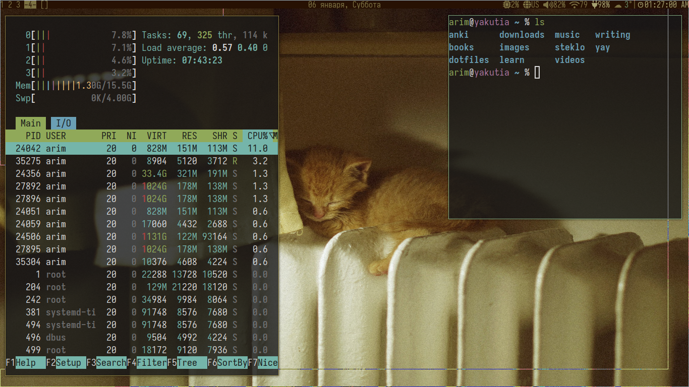

# my dotfiles

Minimal xmonad + xmobar configuration focused on vim-like keybindings and
native command-line utilities over everything-is-a-nail browser use. I
include some of my scripts that might be useful in, for example, changing
keyboard layouts quickly and easily. 

Note that I took `bcn.sh` from [Edesem's excellent
bluetooth-connect-script](https://github.com/Edesem/bluetooth-connect-script)
which you obviously should go check out; the only thing I modified was
some AWK usage and making it POSIX-compliant :^)

This is not meant to be a repo that you can simply download and deploy with no
issues; there are a lot of dependencies here that I might one day sit down and
write all of them down. This repo is meant more as a backup for me and perhaps
can be of some illustrative use for someone who is looking for a simple but
effective configuration of xmonad and/or xmobar.
